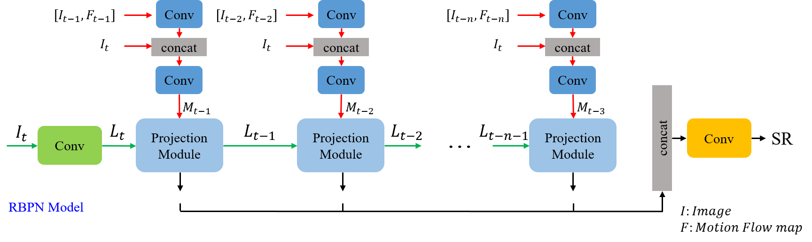
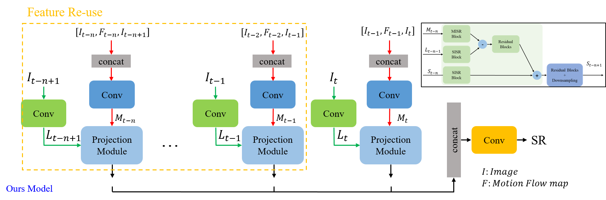

# lightweight-RBPN
This is a model that reduces the size and calculation amount of the model to mount the RBPN, which is an image super resolution model, in a small memory.

## RBPN(CVPR2019)

Project page: https://alterzero.github.io/projects/RBPN.html

### NEWS
* Apr 1, 2020 -> NEW paper on Space-Time Super-Resolution [STARnet](https://github.com/alterzero/STARnet) (to appear in CVPR2020)
* May 9, 2019 -> Added RBPN_F11 (this model was used on NTIRE2019)


## Ours_Model - lightweight RBPN

Reducing the amount of calculation by transforming the model for parts where similar calculations are repeated.

## DBPN
One of the components of the projection module is dbpn.
### [Deep Back-Projection Networks for Super-Resolution (CVPR2018)](https://github.com/alterzero/DBPN-Pytorch)
- Winner (1st) of [NTIRE2018](http://openaccess.thecvf.com/content_cvpr_2018_workshops/papers/w13/Timofte_NTIRE_2018_Challenge_CVPR_2018_paper.pdf) Competition (Track: x8 Bicubic Downsampling)
- Winner of [PIRM2018](https://arxiv.org/pdf/1809.07517.pdf) (1st on Region 2, 3rd on Region 1, and 5th on Region 3)
- Project page: https://alterzero.github.io/projects/DBPN.html


## Getting Started

### Environment Setup

Tested on Titan RTX with python 3.5, pytorch >= 1.0.0, CUDA >= 9.0

1. Install dependencies
```
sudo apt update && sudo apt upgrade
```
2. Set up a pyflow
* Pyflow -> https://github.com/pathak22/pyflow
```Shell
cd pyflow/
python setup.py build_ext -i
cp pyflow*.so ..
```
3. Set up a python environment
```
conda create -n test_env python=3.8
conda activate test_env
pip install torch torchvision
python setup.py build develop
```


## Train & Evaluation

### Dataset Preparation

#### [Vimeo-90K(Train)](http://toflow.csail.mit.edu)
* resolution: 448 X 256
* The number of clips: 13,100
* The number of frames/clip: 7
* The number of frames: 91,701

#### [Vid4(Test) with RBPB pretrained weight](https://drive.google.com/drive/folders/1sI41DH5TUNBKkxRJ-_w5rUf90rN97UFn?usp=sharing)
* resolution: (720 X 576 X 3) X 2, (704 X 576 X 3) X 2
* The number of clips: 4
* The number of frames/clip: 41, 344, 49, 47
* The number of frames: 684
* clip names: Calendar, City, Foliage, Walk

1. Download `Vimeo-90K' and 'Vid4' dataset given link or from MAT.

```
cd /ailab_mat/dataset/Vimeo-90K

cd /ailab_mat/dataset/Vid4
```

2. Organize the folders as follows
```
Vimeo-90K
├── gt
       └──1_0_0_0_0
              ├──0.jpg
              ├──1.jpg
              └──...
├── gt
       └──pretrain_data
              ├──4_0_0_0_0
                     ├──0.jpg
                     ├──1.jpg
                     └──...
              ├──4_1_0_0_0
                     ├──0.jpg
                     ├──1.jpg
                     └──...
              ├──4_0_1_0_0
                     └──...
              ├──4_0_0_1_0
                     └──...
              └──4_0_0_0_1
                     └──...
└── datasets
       ├── multi_degrade
              ├──0_0.jpg
              ├──0_1.jpg
              ├──0_2.jpg
              ├──0_3.jpg
              ├──0_4.jpg     
              ├──1_0.jpg
              ├──1_1.jpg
              └──...
       ├── multi_degrade_0
              ├──0.jpg
              ├──1.jpg
              └──...
```       
### Train on sample dataset

Use vimeo-90k dataset as train(in ./vimeo__septuplet folder)

```python
python main.py
--nFrames 7
--batchSize 8
--gpus 0
```

### Evaluation on test dataset

Use Vid4 dataset as test(in ./Vid4)

```python 
python eval.py
--nFrames 7
--data_dir Vid4
--file_list foliage.txt (Calendar, City, Foliage, Walk)
--model weights/RBPN_4x.pth
--gpus 0
```

## Authors
- **Changhyun Jun** [junch9634](https://github.com/junch9634)

## License
Distributed under the MIT License.

## Acknowledgments
This work was supported by Institute for Information & Communications Technology Promotion(IITP) grant funded by Korea goverment(MSIT) (No.2019-0-01335, Development of AI technology to generate and validate the task plan for assembling furniture in the real and virtual environment by understanding the unstructured multi-modal information from the assembly manual.

## Citations
If you find this work useful, please consider citing it.
```
@inproceedings{RBPN2019,
  title={Recurrent Back-Projection Network for Video Super-Resolution},
  author={Haris, Muhammad and Shakhnarovich, Greg and Ukita, Norimichi},
  booktitle={IEEE Conference on Computer Vision and Pattern Recognition (CVPR)},
  year={2019}
}
```
